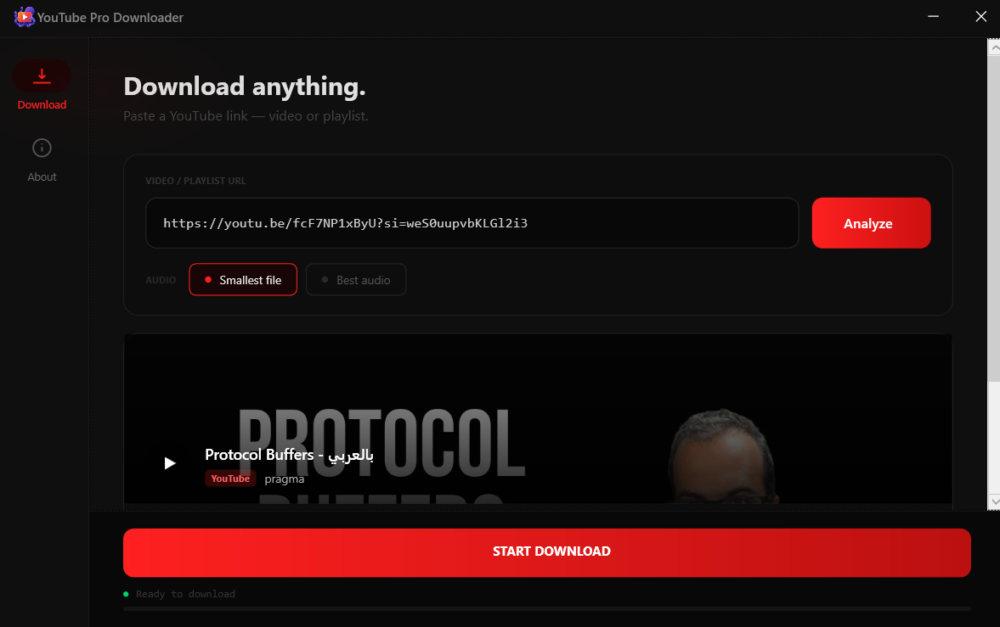

<p align="center">
  
</p>

<h1 align="center">YoutubeDownloader</h1>

<p align="center">
  <strong>A premium, high-performance YouTube video & playlist downloader built with C# and WPF.</strong><br>
  <em>أداة احترافية عالية الأداء لتحميل فيديوهات وقوائم تشغيل يوتيوب، مصممة بلغة C# وتقنية WPF.</em>
</p>

<p align="center">
  
  
  
  
</p>

---

## 📸 Preview / المعاينة


*Designed with a modern Glassmorphism aesthetic and a focus on User Experience.*

---

## ✨ Features / المميزات

### 🇬🇧 English
- **Single & Playlist Support**: Seamlessly download individual videos or entire playlists with metadata.
- **Advanced Quality Selection**: Supports up to 4K resolution (depending on source) and selective audio quality.
- **High-Speed Downloads**: Utilizes concurrent fragments for maximum throughput.
- **Glassmorphism UI**: A stunning, modern interface with dark mode and smooth animations.
- **Auto-Merging**: Automatically merges high-quality video and audio using FFmpeg integration.
- **Real-time Analytics**: Live speed indicators, ETA, and progress tracking.

### 🇦🇪 العربية
- **دعم الفيديوهات وقوائم التشغيل**: تحميل سهل للفيديوهات المنفردة أو قوائم التشغيل الكاملة مع البيانات الوصفية.
- **خيارات جودة متقدمة**: دعم لدقة تصل إلى 4K (حسب المصدر) مع إمكانية اختيار جودة الصوت.
- **تحميل فائق السرعة**: استخدام تقنية الأجزاء المتزامنة لضمان أقصى سرعة ممكنة.
- **واجهة عصرية**: تصميم زجاجي (Glassmorphism) مذهل مع دعم للوضع المظلم وتأثيرات سلسة.
- **دمج تلقائي**: دمج تلقائي لمسارات الفيديو والصوت بجودة عالية باستخدام محرك FFmpeg.
- **إحصائيات مباشرة**: مؤشرات حية للسرعة، الوقت المتبقي، وتتبع التقدم.

---

## 🛠️ Tech Stack / التقنيات المستخدمة

- **Frontend**: WPF (XAML) with modern UI patterns.
- **Runtime**: .NET 10.0 (Windows Sdk).
- **Core Engine**: [yt-dlp](https://github.com/yt-dlp/yt-dlp) - The industry standard for video extraction.
- **Multimedia Engine**: [FFmpeg](https://ffmpeg.org/) - For stream muxing and processing.
- **Libraries**: `WindowsAPICodePack` for shell integration.

---

## 🚀 Installation / التثبيت

### Prerequisites / المتطلبات
1. **.NET 10 Runtime** installed on your Windows machine.
2. `yt-dlp.exe` and `ffmpeg.exe` should be in the application root folder.

### Setup Steps / خطوات الإعداد
```bash
# Clone the repository
git clone https://github.com/Redaessa7/YoutubeDownloader.git

# Navigate to directory
cd YoutubeDownloader

# Build and Run
dotnet run
```

---

## 🤝 Contributing / المساهمة

We welcome contributions! Localize the UI, add new features, or report bugs via Issues.
نرحب بمساهماتكم! سواء في ترجمة الواجهة، إضافة ميزات جديدة، أو الإبلاغ عن الأخطاء عبر قسم Issues.

## 📄 License / الترخيص

Distributed under the **MIT License**. See `LICENSE` for more information.
مرخص تحت رخصة **MIT**. راجع ملف `LICENSE` للمزيد من المعلومات.

<p align="center">
  Made with ❤️ by <a href="https://github.com/Redaessa7">Redaessa7</a>
</p>
